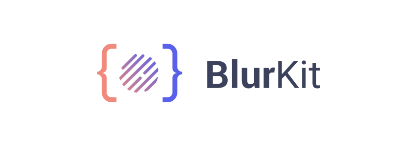

<p align="center">
    
</p>

<p align="center">
    <a href="https://spectrum.chat/camerakit/blurkit/">
        
    </a>
    <a href="https://buddy.works/" target="_blank">
        
    </a>
</p>

## What Is BlurKit?
BlurKit is an extraordinarily easy to use and performant utility to render real time blur effects in Android.

<p align="center">
    
</p>

## Perfomance

BlurKit is faster than other blurring libraries due to a number of bitmap retrieval and drawing optimizations. We've been logging benchmarks for the basic high-intensity tasks for a 300dp x 100dp BlurView:

| Task                      | BlurKit time       | Avg. time without BlurKit |
| --------------------------| -------------------| -----------------------   |
| Retrieve source bitmap    | 1-2 ms             | 8-25 ms                   |
| Blur and draw to BlurView | 1-2 ms             | 10-50ms                   |

This results in an average work/frame time of 2-4ms, which will be a seamless experience for most users and apps.

## Setup
Add __BlurKit__ to the dependencies block of the app level `build.gradle`:
```groovy
dependencies {
    implementation 'io.alterac.blurkit:blurkit:1.1.0'
}
```

## Usage
### BlurLayout
Add a `BlurLayout` to your XML layout just like any other view.

```xml
<io.alterac.blurkit.BlurLayout
    android:id="@+id/blurLayout"
    android:layout_width="150dp"
    android:layout_height="150dp"/>
```
In the `Main_Activity.java` you need to override the `onStart()` and `onStop()` methods to include the `BlurLayout` functionality.
```java
BlurLayout blurLayout;

@Override
protected void onCreate(Bundle savedInstanceState) {
    super.onCreate(savedInstanceState);
    setContentView(R.layout.activity_main);
    blurLayout = findViewById(R.id.blurLayout);
}

@Override
protected void onStart() {
    super.onStart();
    blurLayout.startBlur();
}

@Override
protected void onStop() {
    blurLayout.pauseBlur();
    super.onStop();
}
```

The layout background will continuously blur the content behind it. If you know your background content will be somewhat static, you can set the layout `fps` to `0`. At any time you can re-blur the background content by calling `invalidate()` on the `BlurLayout`. 

```xml
<io.alterac.blurkit.BlurLayout
    android:id="@+id/blurLayout"
    android:layout_width="150dp"
    android:layout_height="150dp"
    blurkit:blk_fps="0" />
```

Other attributes you can configure are the blur radius and the downscale factor. Getting these to work together well can take some experimentation. The downscale factor is a performance optimization; the bitmap for the background content will be downsized by this factor before being drawn and blurred.

```xml
<io.alterac.blurkit.BlurLayout
    android:id="@+id/blurLayout"
    android:layout_width="150dp"
    android:layout_height="150dp"
    blurkit:blk_blurRadius="12"
    blurkit:blk_downscaleFactor="0.12"
    blurkit:blk_fps="60" />
```

### Creating BlurKit Outside Of A Layout
You can use the `BlurKit` class which has a few useful blurring utilities. Before using this class outside of a `BlurLayout`, you need to initialize `BlurKit`.

```java
public class MyApplication extends Application {
    @Override
    public void onCreate() {
        BlurKit.init(this);
    }
}
```

You can blur a `View`, or a `Bitmap` directly.

```java
// View
BlurKit.getInstance().blur(View src, int radius);

// Bitmap
BlurKit.getInstance().blur(Bitmap src, int radius);
```

You can also __fastBlur__ a `View`. This optimizes the view blurring process by allocating a downsized bitmap and using a `Matrix` with the bitmaps `Canvas` to prescale the drawing of the view to the bitmap.

```java
BlurKit.getInstance().fastBlur(View src, int radius, float downscaleFactor);
```


## Upcoming Features
- [ ] `SurfaceView` support
- [ ] Support for use outside of an `Activity` (dialogs, etc.)
- [ ] Enhance retrieval of background content to only include views drawn behind the `BlurLayout`.

## License
BlurKit is [MIT licensed](https://github.com/CameraKit/blurkit-android/blob/master/LICENSE).

---
 Blurkit is a sister project of [CameraKit](https://github.com/CameraKit/camerakit-android) and maintained by the CameraKit team.
